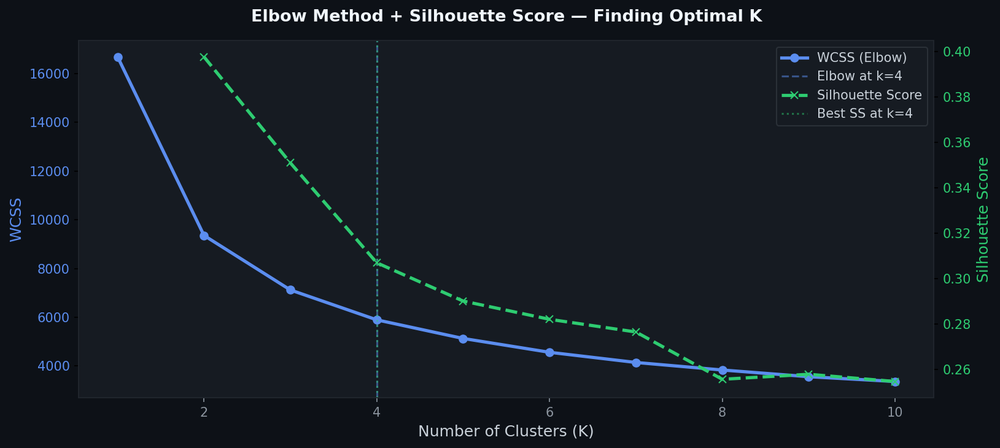
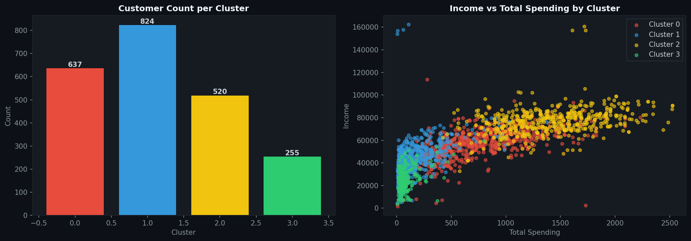

# 🛒 SmartCart Clustering System

> **Unsupervised Machine Learning | Customer Segmentation | K-Means | Agglomerative Clustering**

A customer segmentation system built for **SmartCart** — a growing e-commerce platform. Using clustering algorithms on 2,240 customer records to discover hidden behavioural patterns and enable personalised marketing.

---

## 📋 Table of Contents
- [Problem Statement](#problem-statement)
- [Dataset](#dataset)
- [Pipeline](#pipeline)
- [Results](#results)
- [Project Structure](#project-structure)
- [How to Run](#how-to-run)
- [Key Insights](#key-insights)
- [Tech Stack](#tech-stack)

---

## 🎯 Problem Statement

SmartCart uses **generic marketing strategies** for all customers — leading to:
- Inefficient marketing spend
- Missed opportunities to retain high-value customers
- Inability to identify churn-prone users

**Solution**: Apply unsupervised ML clustering to group customers into meaningful segments based on purchasing behaviour, engagement, and loyalty indicators — enabling **data-driven personalised marketing**.

---

## 📊 Dataset

| Property | Detail |
|----------|--------|
| Total Records | 2,240 customers |
| Features | 22 attributes |
| Categories | Demographics, Purchase Behaviour, Engagement |
| Target | None (Unsupervised Learning) |

**Feature Groups:**

| Group | Features |
|-------|---------|
| Demographics | Age, Income, Education, Marital Status, Children |
| Amount Spent | Wines, Fruits, Meat, Fish, Sweets, Gold |
| Purchase Frequency | Web, Store, Catalog, Deals |
| Engagement | Recency, Web Visits, Complaints |

---

## ⚙️ Pipeline

```
Raw Data → Missing Value Imputation → Feature Engineering
    → Outlier Removal → Encoding → Scaling → PCA (3D)
        → Optimal K Selection → KMeans + Agglomerative Clustering
            → Cluster Analysis & Business Insights
```

### Feature Engineering (New Features Created):
| Feature | Description |
|---------|-------------|
| `Age` | Derived from Year_Birth |
| `Customer_Tenure_Days` | Days since enrollment |
| `Total_Spending` | Sum of all product spends |
| `Total_Children` | Kidhome + Teenhome |
| `Living_With` | Simplified marital status (Partner / Alone) |

---

## 🤖 Results

### Optimal K = 4 (confirmed by both Elbow + Silhouette methods)



### 4 Customer Segments Discovered:

| Cluster | Profile | Income | Spending | Strategy |
|---------|---------|--------|----------|----------|
| 🌟 0 | High-Value Loyalists | High | High | Premium rewards & early access |
| 💤 1 | Inactive / At-Risk | Low | Low | Re-engagement campaigns |
| 🛍️ 2 | Mid-Tier Regular | Medium | Medium | Upsell & cross-sell |
| 🆕 3 | Budget / New Shoppers | Low | Low | Discount-driven offers |



---

## 📁 Project Structure

```
smartcart-clustering-system/
│
├── 📓 notebooks/
│   └── 01_smartcart_main_project.ipynb    ← Full pipeline: EDA → Clustering → Analysis
│
├── 📂 data/
│   └── smartcart_customers.csv             ← Dataset (2,240 records, 22 features)
│
├── 📂 docs/
│   ├── optimal_k_analysis.png              ← Elbow + Silhouette plot
│   └── cluster_analysis.png                ← Cluster characterization plots
│
├── 📂 assignment/
│   └── SmartCart_Clustering_System.pdf     ← Original problem statement
│
├── requirements.txt
├── .gitignore
└── README.md
```

---

## 🚀 How to Run

### 1. Clone the repository
```bash
git clone https://github.com/Nandd11/smartcart-clustering-system.git
cd smartcart-clustering-system
```

### 2. Install dependencies
```bash
pip install -r requirements.txt
```

### 3. Launch Jupyter
```bash
jupyter notebook
```

### 4. Open the notebook
Open `notebooks/01_smartcart_main_project.ipynb` and run all cells.

---

## 💡 Key Insights

- **PCA reduced noise** while preserving cluster structure across 3 dimensions
- **K=4 clusters** confirmed by both Elbow method and Silhouette Score
- **Income + Spending** are the strongest differentiators between segments
- **Agglomerative (Ward linkage)** produced more balanced clusters than K-Means
- SmartCart can now replace generic campaigns with **4 targeted strategies**

---

## 🛠️ Tech Stack


---
